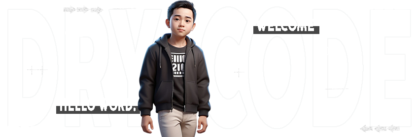

 

 
 
 
   
     
    
### 🔹𝐅𝐫𝐨𝐧𝐭𝐞𝐧𝐝ㅤㅤㅤㅤㅤㅤㅤ

  &nbsp;&nbsp;&nbsp;&nbsp;&nbsp;&nbsp;
  
  

### 🔹𝐁𝐚𝐜𝐤𝐞𝐧𝐝ㅤㅤㅤㅤㅤㅤㅤ

    &nbsp;&nbsp;&nbsp;&nbsp;&nbsp;&nbsp;
    
    <a href="https://www.typescriptlang.org/" target="_blank"> 
    <a href="https://www.python.org/" target="_blank"> 

### 🔹𝐃𝐚𝐭𝐚𝐛𝐚𝐬𝐞𝐬ㅤㅤㅤㅤㅤㅤㅤㅤㅤㅤㅤㅤㅤ

 
    &nbsp;&nbsp;&nbsp;&nbsp;&nbsp;&nbsp;
    

   

   &nbsp;&#10022; 𝐌𝐲 𝐜𝐮𝐫𝐫𝐞𝐧𝐭 𝐠𝐨𝐚𝐥 𝐢𝐬 𝐭𝐨 𝐛𝐞𝐜𝐨𝐦𝐞 𝐚 𝐅𝐮𝐥𝐥 𝐒𝐭𝐚𝐜𝐤 𝐖𝐞𝐛 𝐃𝐞𝐯𝐞𝐥𝐨𝐩𝐞𝐫 𝐀𝐧𝐝 𝐋𝐞𝐭'𝐬 𝐭𝐚𝐥𝐤 𝐚𝐛𝐨𝐮𝐭 𝐖𝐞𝐛 𝐝𝐞𝐯𝐞𝐥𝐨𝐩𝐦𝐞𝐧𝐭 𝐚𝐥𝐨𝐧𝐠 𝐰𝐢𝐭𝐡 𝐢𝐭𝐬 𝐒𝐞𝐜𝐮𝐫𝐢𝐭𝐲 &nbsp;&#10022;
   

 

